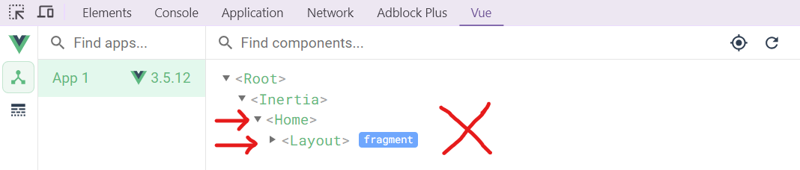
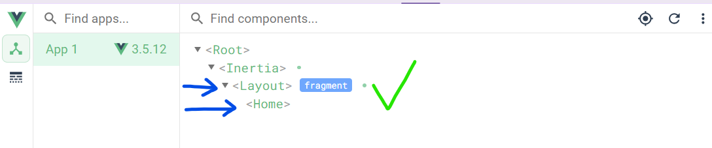

# 1. What is Inertia.js

When you want to take advantage of a backend framework like Laravel—using its ORM, routing, and other built-in features—while also building with modern frontend frameworks like Vue or React, the typical solution is to create a REST or GraphQL API to connect them.

However, this setup introduces a lot of complexity. You need to manage authentication, handle CORS, maintain two repositories, and deal with more complicated deployments. It can quickly become overwhelming just to get everything working together smoothly.

This is where Inertia comes in. Inertia works just like a traditional server-side rendered application: you create controllers, fetch data from the database through your ORM, and render views. But instead of Blade templates, these views are JavaScript page components written in Vue, React, or Svelte.

With Inertia, you get the simplicity of server-side development combined with the power of a modern SPA—without the need to build an API. It streamlines your workflow, letting you focus on building your application, not managing unnecessary complexity.

Inertia does this via **adapters**. currently it have three official client-side adapters (`React`, `Vue`, and `Svelte`) and three server-side adapters (`Laravel`, `Rails`, and `Phoenix`), but it's fine-tuned for `Laravel`.

# 2. Installation

## a. Starter kits:

Laravel's starter kits, `Breeze` and `Jetstream`, provide out-of-the-box scaffolding for new Inertia applications. These starter kits are the absolute fastest way to start building a new Inertia project using Laravel and Vue or React. However, if you would like to install Inertia manually into your application, it has two parts: the server side and the client side.

## b. Server-side Setup:

- First, install laravel **adapter**

```shell
composer require inertiajs/inertia-laravel
```

- Setup the root template **(app.blade.php)**

```html
<!DOCTYPE html>
<html>
  <head>
    <meta charset="utf-8" />
    <meta name="viewport" content="width=device-width, initial-scale=1.0, maximum-scale=1.0" />
    @vite('resources/js/app.js')
    @inertiaHead
  </head>
  <body>
    @inertia
  </body>
</html>
```

-  Setup the Inertia middleware

```shell
php artisan inertia:middleware
```

then append the `HandleInertiaRequests` middleware to the `web` middleware group in your application's `bootstrap/app.php` file.

```php
use App\Http\Middleware\HandleInertiaRequests;

->withMiddleware(function (Middleware $middleware) {
    $middleware->web(append: [
        HandleInertiaRequests::class,
    ]);
})
```

## c. Client-side Setup:

- Install your front-end framework **adapter**

```shell
npm install @inertiajs/vue3
```

- Add the vue plugin

```shell
npm i @vitejs/plugin-vue
```

and add it to your **vite.config.js** file:

```js
import { defineConfig } from 'vite';
import vue from '@vitejs/plugin-vue'; // --> ADD THIS LINE
import laravel from 'laravel-vite-plugin';

export default defineConfig({
    plugins: [
        vue(),  // --> ADD THIS LINE
        laravel({
            input: ['resources/css/app.css', 'resources/js/app.js'],
            refresh: true,
        }),
```

- Setup the main JavaScript file to boot your Inertia app **resources/js/app.js**

```js
import { createApp, h } from 'vue'
import { createInertiaApp } from '@inertiajs/vue3'

createInertiaApp({
  resolve: name => {
    const pages = import.meta.glob('./Pages/**/*.vue', { eager: true })
    return pages[`./Pages/${name}.vue`]
  },
  setup({ el, App, props, plugin }) {
    createApp({ render: () => h(App, props) })
      .use(plugin)
      .mount(el)
  },
})
```

# 3. Pages

When using Inertia, each page in your application has a corresponding controller and route, just like in a traditional server-rendered app. However, instead of Blade templates, these pages are JavaScript components written in Vue, React, or Svelte. This allows you to build modern, dynamic frontends without needing an API.

## a. Rendering Pages from Controllers:

Rendering an Inertia page works similarly to Blade views. In your controller, instead of returning a Blade view, you return an Inertia response using either the `Inertia::render()` method or the `inertia()` helper. The syntax is almost identical to the `view()` helper you’re used to.

```php
class UserController extends Controller
{
    public function show(User $user)
    {
        return inertia('User/Show', ['user' => $user]);
    }
}
```

This makes the transition to Inertia smooth, as you continue to use familiar syntax for rendering views. For example, `User/Show` refers to the component stored in `resources/js/Pages/User/Show.vue`.

## b. Creating Pages:

Inertia pages are regular JavaScript components. They are stored in `resources/js/Pages`, mirroring how Blade views were stored in `resources/views`. If you are familiar with building Vue, React, or Svelte components, you’ll find the process straightforward—pages simply receive data from your controllers as props.

Here’s an example of an Inertia page component in Vue 3:

```html
<script setup>
defineProps({ user: Object })

</script>

<template>
    <p>Hello {{ user.name }}, welcome to your first Inertia app!</p>
</template> 
```

## c. Redirects with Inertia:

One of the biggest advantages of using Inertia is that it eliminates the need to build APIs for every action. With Inertia, you don't have to return JSON responses for non-GET requests; you can simply use regular redirects, just like you would in a Blade-based application.

Here’s an example of a typical store function:

```php
class UsersController extends Controller
{
    public function store(Request $request)
    {
        User::create($request->validate([
            'name' => ['required', 'max:50'],
            'email' => ['required', 'email', 'max:50'],
        ]));

        return to_route('users.index');
    }
}
```

After storing a new user, the `store()` method redirects to the index page. Inertia automatically follows the redirect and updates the page without needing a full page reload. This feels just like a classic server-side app, but with the interactivity of a modern SPA.

For non-GET requests like `PUT`, `PATCH`, or `DELETE`, Inertia uses 303 redirects to ensure the next request is treated as a `GET`. This ensures smooth navigation between pages without unexpected behavior.

## d. Security and Data Handling:

It’s recommended to return only the necessary fields from your models to avoid exposing sensitive data to the frontend. Since all props passed to Inertia components become available on the client-side, it's essential to minimize the data you send. For example, instead of returning all user fields, you can select only what’s needed:

```php
public function index()
{
    return Inertia::render('Users/Index', [
        'users' => User::select('id', 'name', 'email')->get(),
    ]);
}
```

By limiting the data to only the required fields, you reduce the risk of unintentionally leaking sensitive information, such as passwords, API keys, or personal details. This practice not only enhances security but also improves performance by sending lighter responses to the frontend.

# 4. Layouts

For most projects, it’s a good idea to create a site-wide layout that all your pages can extend for consistency and reuse.

You can create a layout component at `resources/js/Layouts/Layout.vue` and use it in your pages like this:

```html
<script setup>
import Layout from "../Layouts/Layout.vue";
</script>

<template>
        <Layout>
            <h1>Welcome to the app</h1>
        </Layout>
</template>
```

Nothing fancy—just standard Vue, and it will work as expected. However, there’s one caveat: the layout becomes a child of the page component where it's used. This means that every time the page changes, the layout instance gets destroyed and recreated, which can lead to unnecessary re-renders and loss of state between visits.



To address the issue of layouts being destroyed between page visits, we can use the `defineOptions()` feature in Vue 3 like this:

```html
<script setup>
import Layout from "../Layouts/Layout.vue";
defineOptions({layout: Layout})
</script>

<template>
        <div class="">
            <h1>Welcome to the app</h1>
        </div>
</template>
```

This approach ensures that the layout is correctly applied without being destroyed and recreated on every navigation, preserving its state.

## Defining a Default Layout

We can also define a **default layout** that will be applied to all pages unless a specific one is provided. To do this, modify your `resources/js/app.js` file in the **resolve** method:

```js
import Layout from "./Layouts/Layout.vue";

resolve: (name) => {
        const pages = import.meta.glob("./Pages/**/*.vue", { eager: true });
        // return pages[`./Pages/${name}.vue`]; <-- change this

        // to this:
        let page = pages[`./Pages/${name}.vue`];
        page.default.layout = page.default.layout || Layout;
        return page;
    },
```

With this setup, every page will automatically use the `Layout` component unless another layout is explicitly defined.

`Dashboard.vue`

```html
<script setup>
// This page will use the default Layout.
</script>

<template>
            <h1>Welcome To Dashboard</h1>
</template>
```

`Home.vue`

```html
<!-- This page uses a custom Guest layout -->
<script setup>
import Guest from "../Layouts/Guest.vue";
defineOptions({layout: Guest})
</script>

<template>
        <div class="">
            <h1>Welcome To Home</h1>
        </div>
</template>
```

This approach ensures that pages default to a layout, but you still have the flexibility to assign custom layouts when needed. It improves performance by avoiding unnecessary layout re-renders while keeping your code maintainable and consistent.

# 5. Named Routes

In Laravel, we use the **`route()`** helper to generate URLs for named routes. However, this helper isn't available on the client-side by default.

This is where [Ziggy](https://github.com/tighten/ziggy) package comes in. Ziggy provides a JavaScript version of Laravel’s `route()` function, making it seamless to use named routes in your JavaScript code. This package is also included in Laravel's starter kits for the same purpose.

## a. Installing Ziggy:

First, install Ziggy in your Laravel app via Composer:

```shell
composer require tightenco/ziggy
```

Next, register Ziggy in your `resources/js/app.js` as a plugin:

```js
import { ZiggyVue } from '../../vendor/tightenco/ziggy';

// Add it inside the setup method
setup({ el, App, props, plugin }) {
  createApp({ render: () => h(App, props) })
    .use(plugin)
    .use(ZiggyVue)  // Register Ziggy here
    .mount(el);
}
```

Finally, add the `@routes` directive in your `app.blade.php` to make your Laravel routes available in JavaScript:

```html
<!DOCTYPE html>
<html>
  <head>
    <meta charset="utf-8" />
    <meta name="viewport" content="width=device-width, initial-scale=1.0, maximum-scale=1.0" />
    @vite('resources/js/app.js')
    @vite('resources/css/app.css')
    @inertiaHead
    @routes  <!-- Add this directive -->
  </head>
  <body>
    @inertia
  </body>
</html>
```

## b. Using Ziggy:

Now you can use the `route()` function in your components just like Laravel’s `route()` helper. When setting links, make sure to use `:href` to bind the dynamic URL:

```html
<Link :href="route('home')" >Home</Link>
```

With Ziggy, managing named routes on the client-side becomes as straightforward as in your server-side Blade views, enhancing consistency and reducing the risk of hardcoded URLs.

# 6. Head Component

Since Inertia render within the `<body>` tag, it doesn't have direct control over the `<head>` section of the document. To solve this, Inertia provides a `<Head>` component for setting the page's `<title>`, `<meta>` tags, and other `<head>` elements.

Use the `<Head>` component to include elements like `<title>` and `<meta>` tags inside the document's `<head>`.

```html
<script setup>
import { Head } from '@inertiajs/vue3'
</script>
    
<template>
  <Head>
    <title>Your page title</title>
    <meta name="description" content="Your page description" />
  </Head>
</template>
```

For simpler use cases, you can pass the title directly as a prop to the `<Head>` component:

```html
<script setup>
import { Head } from '@inertiajs/vue3'
</script>
    
<template>
  <Head title="Your page title" />
</template>
```

To apply a consistent title format across your app, use the `title` callback in the `createInertiaApp` setup, typically located in `resources/js/app.js`:

```js
createInertiaApp({
  title: (title) => `${title} | My App`,  // <--- Add this

  resolve: (name) => {
    // Define your default layout here if needed
  },
  setup({ el, App, props, plugin }) {
    // Use the Ziggy plugin if previously configured
  },
});
```

Then on `Home` page for example, we can use it like this:

```html
<Head title="Home |">
```

This will render the following `<title>`:

```html
<title>Home | My App</title>
```

💡 **Tip:** it's always better to keep separators (like `|` or `-`) on the specified component , this way, if no specific title is provided, the output will be **My App** not  **| My App** .

# 7. Link Component

The `<Link>` component in Inertia is a wrapper around standard `<a>` tags, intercepting clicks to prevent full page reloads. This gives your app a single-page experience once loaded.

To create a link, import and use the `<Link>` component:

```html
<script setup>
import { Link } from '@inertiajs/vue3'
</script>

<template>
  <Link href="/">Home</Link>
</template>
```

You can set the HTTP method with the `method` prop (default is `GET`):

```html
<Link href="/logout" method="post">Logout</Link>
```

By default, it renders as an `<a>` tag, but you can change it using the `as` prop.

Avoid using `<a>` for non-GET requests to prevent accessibility issues with “Open Link in New Tab.” Use `<button>` instead:

```html
<Link href="/logout" method="post" as="button" type="button">Logout</Link>
<!-- Renders as <button type="button">Logout</button> -->
```

For `POST` or `PUT` requests, use the `data` prop to pass additional data:

```php
Route::post('/test', function(Request $request){
    dd($request->all());
})->name('test');
```

```html
<Link :href="route('test')" method="post" :data="{ foo: 'bar' }" >Save</Link>
```

This will return:

```js
["foo" => "bar"]
```

By default, Inertia pushes new states into the history. Setting `replace` to `true` will replace the current state instead:

```html
<Link href="/" replace>Home</Link>
```

Prevent scroll resets by using the `preserve-scroll` prop:

```html
<Link href="/" preserve-scroll>Home</Link>
```

We can set the active link states based on the current page using comparisons with `$page.url` or `$page.component`:

```html
// URL exact match...
<Link href="/users" :class="{ 'active': $page.url === '/users' }">Users</Link>

// Component exact match...
<Link href="/users" :class="{ 'active': $page.component === 'Users/Index' }">Users</Link>

// URL starts with (/users, /users/create, /users/1, etc.)...
<Link href="/users" :class="{ 'active': $page.url.startsWith('/users') }">Users</Link>

// Component starts with (Users/Index, Users/Create, Users/Show, etc.)...
<Link href="/users" :class="{ 'active': $page.component.startsWith('Users') }">Users</Link>
```

# 8. Global Components

Since `<Link>` and `<Head>` are used frequently across multiple pages, it’s more efficient to register them globally instead of importing them repeatedly. This allows you to use these components anywhere without needing to import them in every file.

To register them globally, modify your `resources/js/app.js` like this:

```js
import { createInertiaApp, Link, Head } from "@inertiajs/vue3";

setup({ el, App, props, plugin }) {
    createApp({ render: () => h(App, props) })
        .use(plugin)
        .component('Link', Link)  // Register Link globally
        .component('Head', Head)  // Register Head globally
        .use(ZiggyVue)            
        .mount(el);               
}},
```

Now, you can use `<Link>` and `<Head>` components in any template without importing them.

# 9. Manual Visits, router()

Inertia allows you to make visits or requests programmatically using JavaScript. This can be useful for triggering page transitions or API calls without relying on links. You can achieve this using the `router.visit()` method.

```js
import { router } from '@inertiajs/vue3'

router.visit(url, {
  method: 'get',           // HTTP method (default is 'get')
  data: {},                // Data sent with the request
  replace: false,          // Replace current history state (default is 'push')
  preserveState: false,    // Retain component state on reload
  preserveScroll: false,   // Keep the scroll position
  only: [],                // Fetch only specific props
  headers: {},             // Custom headers
  onCancelToken: token => {},
  onCancel: () => {},
  onBefore: visit => {},   // Triggered before the visit starts
  onStart: visit => {},    // Triggered when visit begins
  onProgress: progress => {}, 
  onSuccess: page => {},   // Triggered on successful visit
  onError: errors => {},   // Handle errors
  onFinish: visit => {}    // Always runs after visit ends
})
```

Instead of using `router.visit()` directly, Inertia provides convenient methods for each HTTP verb:

```js
import { router } from '@inertiajs/vue3'

router.get(url, data, options)
router.post(url, data, options)
router.put(url, data, options)
router.patch(url, data, options)
router.delete(url, options)
router.reload(options)  // Reloads the current page with state preserved
```

- **`router.reload()`**: Perfect for refreshing the current page without losing scroll position or state.

For sending data:

```js
router.post('/users', {
  name: 'John Doe',
  email: 'john.doe@example.com',
})
```

To ensure data is sent as `FormData` (for file uploads), use the `forceFormData` option:

```js
router.post('/companies', data, { forceFormData: true })
```

# 10. Forms

Inertia offers an efficient way to submit forms by avoiding full-page reloads. Instead of classic HTML form submissions, it intercepts them and sends requests via Inertia, providing a smoother user experience.

## a. Basic Form Submission:

```html
<script setup>
import { reactive } from 'vue'
import { router } from '@inertiajs/vue3'

const form = reactive({
  first_name: null,
  last_name: null,
  email: null,
})

function submit() {
  router.post('/users', form)
}
</script>

<template>
  <form @submit.prevent="submit">
    <label for="first_name">First name:</label>
    <input id="first_name" v-model="form.first_name" />

    <label for="last_name">Last name:</label>
    <input id="last_name" v-model="form.last_name" />

    <label for="email">Email:</label>
    <input id="email" v-model="form.email" />

    <button type="submit">Submit</button>
  </form>
</template>
```

## b. Using Inertia's useForm() Helper:

Inertia provides the `useForm` helper to simplify form handling by reducing boilerplate code. This helper includes built-in tracking of form state, validation errors, and submission status.

```js
<script setup>
import { useForm } from '@inertiajs/vue3'

const form = useForm({
  email: '',
  password: '',
  remember: false,
})
</script>

<template>
  <form @submit.prevent="form.post('/login')">
    <input type="text" v-model="form.email" placeholder="Email" />
    <div v-if="form.errors.email">{{ form.errors.email }}</div>

    <input type="password" v-model="form.password" placeholder="Password" />
    <div v-if="form.errors.password">{{ form.errors.password }}</div>

    <input type="checkbox" v-model="form.remember" /> Remember Me

    <button type="submit" :disabled="form.processing">Login</button>
  </form>
</template>

```

To prevent users from submitting the form multiple times by accident, use the `form.processing` property. This is a boolean that indicates whether the form is currently being submitted. You can disable the submit button based on this status.

```html
<button type="submit" :disabled="form.processing">
      <span v-if="form.processing">Submitting...</span>
      <span v-else>Login</span>
</button>
```

## c. File Upload:

Inertia automatically converts requests containing files into `FormData` objects to support `multipart/form-data` requests. This ensures compatibility with file uploads through XHR (XMLHttpRequest).

```html
<script setup>
import { useForm } from '@inertiajs/vue3'

const form = useForm({
  name: null,
  avatar: null,
})

function submit() {
  form.post('/users')
}
</script>

<template>
  <form @submit.prevent="submit">
    <input type="text" v-model="form.name" placeholder="Enter name" />

    <input type="file" @input="form.avatar = $event.target.files[0]" />

    <progress v-if="form.progress" :value="form.progress.percentage" max="100">
      {{ form.progress.percentage }}%
    </progress>

    <button type="submit">Submit</button>
  </form>
</template>
```

Using the `useForm` helper allows you to easily monitor the upload status and display progress.

Some server frameworks may not support file uploads using `PUT`, `PATCH`, or `DELETE` requests. A common workaround is to use a `POST` request instead. For example, frameworks like **Laravel** and **Rails** support *method spoofing*, allowing you to upload files with `POST` while treating the request as `PUT` or `PATCH`.

```js
import { router } from '@inertiajs/vue3'

router.post(`/users/${user.id}`, {
  _method: 'put',  // Spoofs a PUT request
  avatar: form.avatar,
})
```

## d. Validation:

Inertia handles server-side validation errors differently than classic XHR-driven forms, providing a seamless experience that feels like a full-page form submission. Here’s a detailed breakdown of how validation works with Inertia:

1. **Form Submission:**  
   When a form is submitted via Inertia, the server checks for validation errors.

2. **Error Handling:**  
   If there are validation errors:
   
   - The server **redirects** the user back to the original form page.
   - Validation errors are **flashed** in the session (Laravel does this automatically).

3. **Client-Side Error Availability:**  
   Inertia makes these session errors available as **page props** on the client side. These props are reactive, meaning they will automatically update in the form without extra logic.

4. **Error Callbacks:**  
   If the server returns validation errors, Inertia will call the `onError()` callback instead of `onSuccess()`.

Here’s how to build a simple form with validation error display using Vue 3 and Inertia.

```html
<script setup>
import { useForm } from '@inertiajs/vue3'

const form = useForm({
  first_name: '',
  last_name: '',
  email: '',
})

function submit() {
  form.post('/users')
}
</script>

<template>
  <form @submit.prevent="submit">
    <label for="first_name">First Name:</label>
    <input id="first_name" v-model="form.first_name" />
    <div v-if="form.errors.first_name" class="error">{{ form.errors.first_name }}</div>

    <label for="last_name">Last Name:</label>
    <input id="last_name" v-model="form.last_name" />
    <div v-if="form.errors.last_name" class="error">{{ form.errors.last_name }}</div>

    <label for="email">Email:</label>
    <input id="email" v-model="form.email" />
    <div v-if="form.errors.email" class="error">{{ form.errors.email }}</div>

    <button type="submit">Submit</button>

    <div v-if="form.processing">Submitting...</div>
  </form>
</template>
```

One of the key advantages of Inertia is that it automatically **preserves the component state** for `POST`, `PUT`, `PATCH`, and `DELETE` requests. This means:

- **Old form input data** will remain intact when the user is redirected back to the form page.
- There’s no need to manually repopulate the input fields.

# 11. Sharing Data

The most common way to share data in Laravel is through the `HandleInertiaRequests` middleware. This ensures that data is available across all Inertia responses without manually passing it to each page.

```php
class HandleInertiaRequests extends Middleware
{
    public function share(Request $request)
    {
        return array_merge(parent::share($request), [
            // Synchronous data (shared immediately)
            'appName' => config('app.name'),

            // Lazy-loaded data (shared only when accessed)
            'auth.user' => fn () => $request->user()
                ? $request->user()->only('id', 'name', 'email')
                : null,
        ]);
    }
}
```

Once shared server-side, the data becomes available client-side via `usePage()`.

```html
<script setup>
import { computed } from 'vue'
import { usePage } from '@inertiajs/vue3'

const page = usePage()

const user = computed(() => page.props.auth.user)
</script>

<template>
    <p>
      You are logged in as: {{ user.name }}
    </p>
</template>
```
